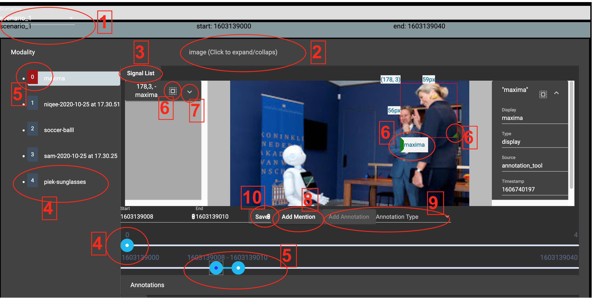

# GRMC Annotations

## Install

* Install node.js
        
        brew install angular-cli
        ng --version
        cd webapp
        ng server
        
* Setup certificate next to `app.py` 

        openssl req -x509 -newkey rsa:4096 -nodes -out cert.pem -keyout key.pem -days 365
        
* Setup python

        python -m venv venv
        source venv/bin/activate
        pip install -r requirements.txt

* Run the webserver, optionally with a path to the folder containing the scenario data (default is *data/*)

        python app.py -d /path/to/my/scenarios
        
  When starting the webserver for the first time, visit `https://localhost:5000/api/scenario` in the browser and accept
  the risk. After this the browser accepts the certificate.
  
* Open the webapp at `https://localhost:4200`
  
# Add data

By default the *data/* folder in this repository is used, any other folder can be specified when running `app.py`.
Expected folder structure:

        |- data/
          |- scenario_name_1/
            |- image
              |- pic_1603139010.jpg
            |- text
              |- chat_1.csv
            image.json
            scenario_name_1.json
            text.json
          |- scenario_name_2/
            |- image
            |- text
            image.json
            scenario_name_2.json
            text.json

The tool helps to edit the json files with the scenario metadata in the above tree structure.
If the files already exist, they are used, if not, the will be generated from the content of the 
`image/` and `text/` folders in each scenario. Note that the tool will create one signal for each
image entry, i.e. if an image is used multiple times, it should be placed there with multiple copies.

### Preprocessing

When creating the metadata the tool will infer some information:

#### Timing
It will try to guess the timestamps of the signals. For text it will
be loaded from the *.csv* file, for images it will try to infer it from the file name. 

#### Tokenization

It will perform tokenization of the text signals in the provided *.csv* files.

#### Display values

It will add annotations containing display values that can be used in the GUI.

## Usage

### Workflow for images

1. Select a scenario
1. Select a modality
1. Show a list of the signals for the scenario (folded by default)
1. Select a signal either from the list of signals or from the timeline
1. Click the Badge of the signal in the list to enable positioning on the timeline and move the slider. When done
   click the Badge again to disable time editing. *Note: currently the selection get's lost when disabling editing* 
1. Select a segment from the list of segments. When selected dragging the bounding box can be enabled by clicking
   on the label below the bounding box. Size can be adjusted by dragging the bottom right corner of the bounding box. 
1. Expand the segment for editing (same for annotations)
1. Add a mention (generatates a single bounding box for the image)
1. Add annotations to the mention after selecting an annotation type.
1. Save after modifications (use any *Save* button you can find)

### Workflow for images

For step 1. - 5. follow the instructions for images.
1. Add a mention (empty by default)
1. Select the tokens that belong to the mention by clicking on them.
1. Select a mention by selecting a segment from the segment list (to be improved) or an annotation from the
   annotation list
1. Expand segment or annotation for editing (to be improved).
1. Add annotations to the mention after selecting an annotation type.
1. Save after modifications (use any *Save* button you can find)

### Version Control

Save as often as possible. Setup version control in your data folder and commit the JSON files to version control, as currently there is no *Undo*
functionality!